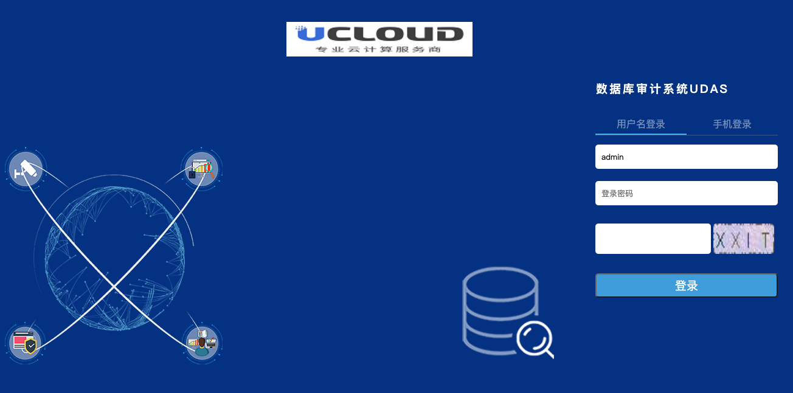
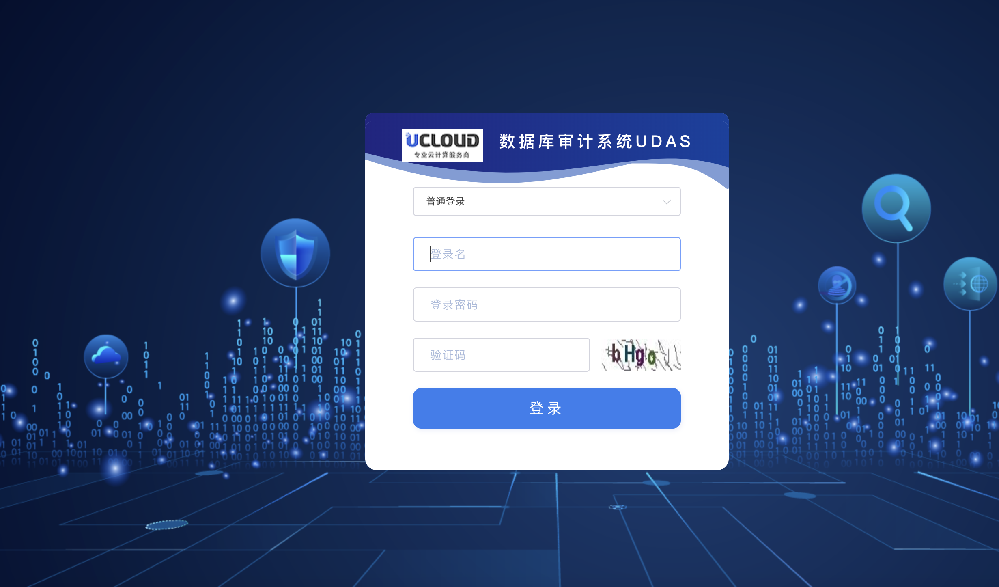

# 1、登录系统

打开浏览器，在地址栏输入审计设备的管理IP地址或输入 https://数据库审计IP
  * 6.0版本外网IP登陆请放开443,8443端口
  * 5.0版本外网IP登陆放开443端口

**初始的登陆账号和登陆密码为：**

***5.0版本初始登陆账号和登陆密码***

* 审计管理平台：auditadmin/!1fw@2soc#3vpn 

* 规则管理平台：ruleadmin/!1fw@2soc#3vpn

* 系统管理平台：admin/!1fw@2soc#3vpn 

  

***6.0版本初始登陆账号和登陆密码***
  
* 系统管理员sysadmin/3edc$RFV 

* 安全管理员secadmin/3edc$RFV

* 审计管理员auditadmin/3edc$RFV 

  