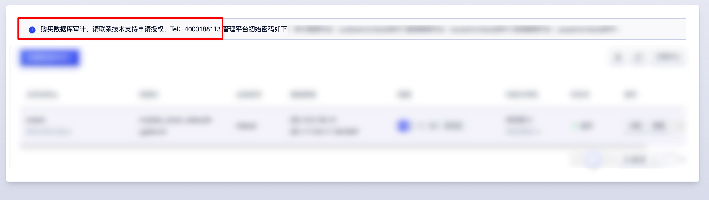
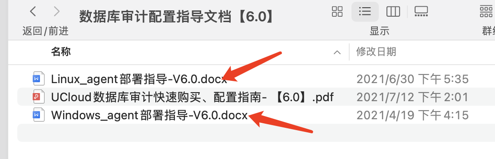
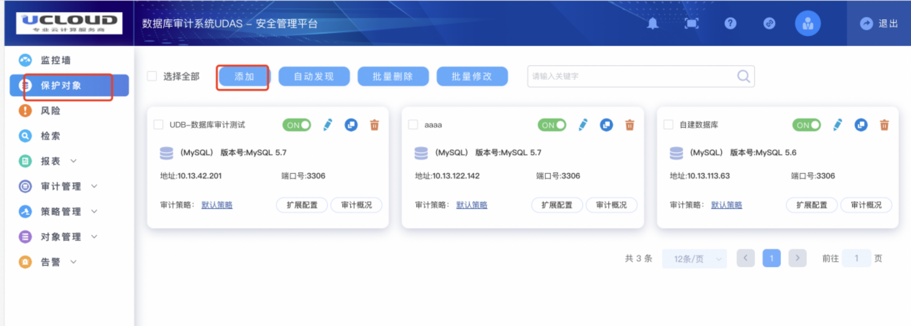
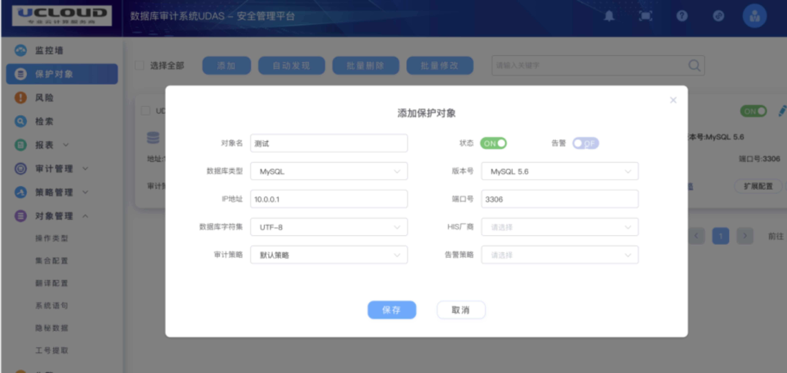
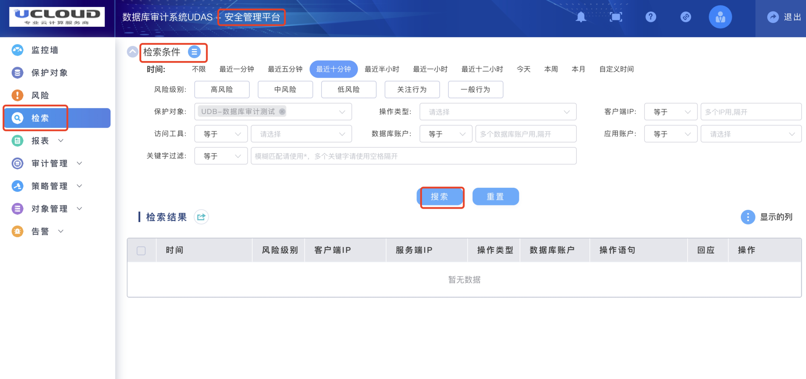

# 数据库审计快速上手指导

[**数据库审计快速上手指导文档【6.0】**](https://dn-audit-docs.cn-bj.ufileos.com/%E6%95%B0%E6%8D%AE%E5%BA%93%E5%AE%A1%E8%AE%A1%E9%85%8D%E7%BD%AE%E6%8C%87%E5%AF%BC%E6%96%87%E6%A1%A3%E3%80%906.0%E3%80%91.zip)

## 一、 部署前说明
### 1、注意点:云数据库环境配置，需要在agent的引流下完成审计的整个过程

### 2、agent部署模式：

  #### (1)、客户端模式：

    云数据库/自建数据库：agent部署在访问数据库的应用服务端（客户端）

#### (2)、服务端模式：agent部署在数据库的底层操作系统上（服务端），但会占用底层主机的性能（CPU、内存阀值不超过主机整体的5%,超过阀值乎自动重启），部署前需先评估业务流量大小机底层主机性能

    云数据库：业务端后台部署agent

    自建数据库：客户自行部署agent

### 3、数据库审计、数据库、应用服务器建议在同一内网环境，不推荐外网访问（数据转发为明文传输）

### 4、数据库审计不支持到期前删除退费（使用满3个月支持删除）

### 5、数据库审计6.0各平台默认账号密码：默认首次登陆强制改密

    系统管理员sysadmin/3edc$RFV 

    安全管理员secadmin/3edc$RFV

    审计管理员auditadmin/3edc$RFV
    
### 6、数据库审计需要开放的外网防火墙端口：

     8443：web页面登陆验证码使用
     
     433: 前端 https前端页面访问
     
     22: 后台登录-非必要不需要开放
     
    

## 二 、部署数据库审计

### 1\. 购买数据库审计

#### 目前支持的可用区包括：国内常用区域；如需特殊区域部署上线，请联系技术支持申请！

    访问路径：产品与服务-\>优盾-\>数据库审计
      
    点击购买数据库审计，并选择相应的配置，完整支付及自动创建（大约5分钟）

#### 数据盘大小估算参考：https://docs.ucloud.cn/udas/concepts/shujupan 同步支持后期弹性扩容

## 2\. 申请并导入授权

**默认创建的数据库审计是没有license授权的，需提供注册文件，联系技术支持/产品负责人申请**

    打开浏览器，在地址栏输入设备https://EIP,登录系统管理平台,下载注册信息文件，将授权给到申请人。

    系统管理平台：sysadmin/3edc$RFV 

## 3\. 导入授权

    拿到授权文件进行文件导入，导入之后就可以看到数据库审计具体的实例个数和有效时间 

## 4\.下载并部署agent（UDB上部署agent，请联系业务人员处理）

#### 4.1、下载agent

    系统管理平台-部署方式，下载对应版本的agent，目前支持支持Linux和windows版本的agent

#### 4、2部署agent

**参考对应版本agent部署文档：**

* 《Linux_agent部署指导-V6.0》

* 《windows_agent部署指导-V6.0》

* [agent部署指导手册](https://dn-audit-docs.cn-bj.ufileos.com/%E6%95%B0%E6%8D%AE%E5%BA%93%E5%AE%A1%E8%AE%A1%E9%85%8D%E7%BD%AE%E6%8C%87%E5%AF%BC%E6%96%87%E6%A1%A3%E3%80%906.0%E3%80%91.zip)

## 5\. 配置审计规则及审计对象

    打开浏览器，在地址栏输入https://EIP，在弹出的登陆页面输入规则用户名/密码：安全管理员secadmin/3edc$RFV后，安全管理平台。

    点击‘保护对象’，点击“添加”，输入需要被审计数据库服务器的相关信息，输入完成以后点击保存，如下图所示：

 

 

 

**注：操作日志全量审计，审计策略为出发对应规则的风险告警**

## 6\. 查看审计结果

    在目前的安全管理平台，检索模块，选择对应的检索条件（默认不选为全选），点击检索

**查询审计日志**

**审计结果展示**

